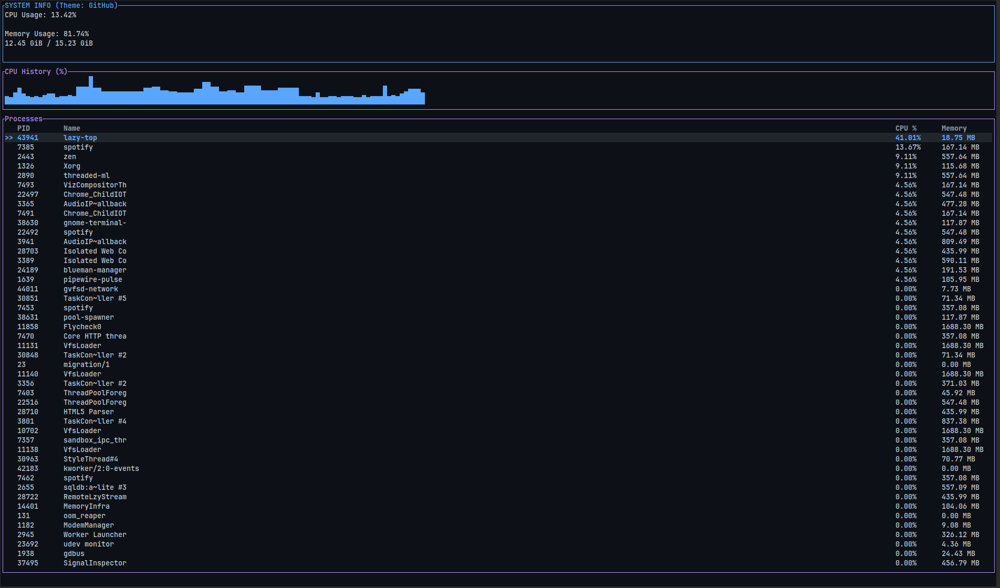
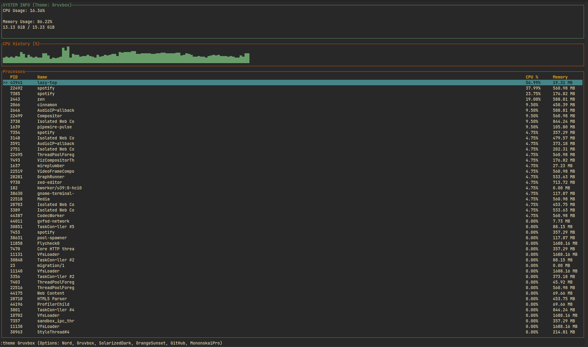
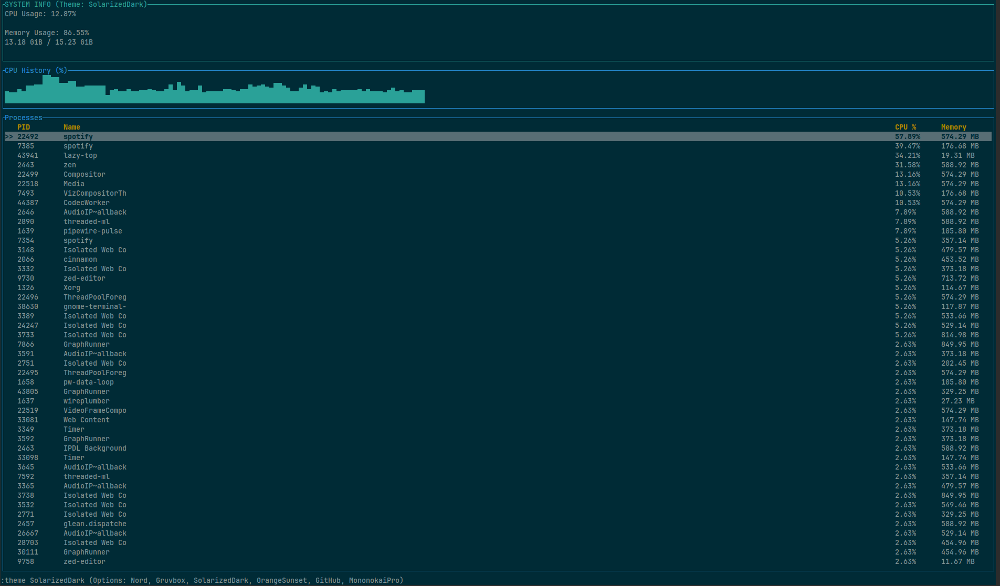
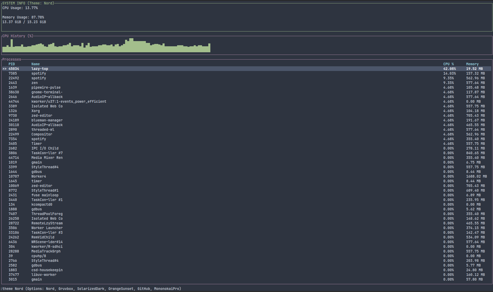
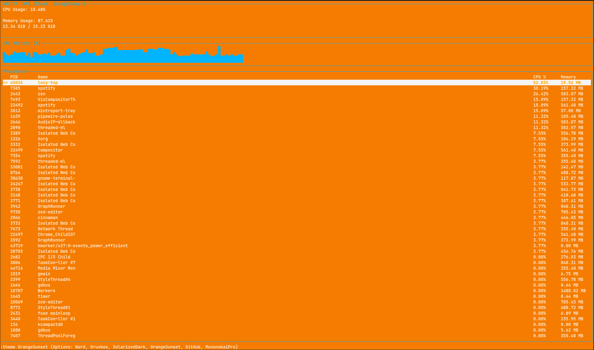

# lazy-top

`lazy-top` is a terminal-based process viewer inspired by `htop` and `btop`, built with Rust and Ratatui. It provides a clean, interactive interface to monitor system processes, CPU usage, and memory consumption, all while offering customizable themes.

## Features

*   **Real-time Process Monitoring:** View a list of running processes with their PID, Name, CPU usage, and Memory consumption.
*   **Sort Processes:** Sort processes by PID, Name, CPU usage, or Memory.
*   **Filter Processes:** Easily filter processes by name using a command-line interface.
*   **Kill Processes:** Terminate selected processes directly from the application.
*   **CPU Usage Graph:** Visualize global CPU usage over time with a sparkline graph.
*   **Customizable Themes:** Switch between several pre-defined color themes to personalize your experience.
*   **Theme Preview:** Preview themes in real-time before applying them.

## Installation

To install `lazy-top`, you need to have Rust and Cargo installed on your system. If you don't have them, you can install them from [rustup.rs](https://rustup.rs/).

### From crates.io

You can also install `lazy-top` directly from crates.io using `cargo install`:

```bash
cargo install lazy-top
```

This will build and install the executable in your Cargo bin directory (`~/.cargo/bin/`).

### From Source

Once Rust is installed, you can clone the repository and build the project:

```bash
git clone https://github.com/your-username/lazy-top.git
cd lazy-top
cargo build --release
```

After building, the executable will be located at `target/release/lazy-top`. You can move it to a directory in your PATH for easier access:

```bash
sudo mv target/release/lazy-top /usr/local/bin/
```

## Usage

Run `lazy-top` from your terminal:

```bash
lazy-top
```


### Keybindings

*   `q`: Quit the application.
*   `:`: Enter command mode.
*   `/`: Enter filtering mode.
*   `k`: Kill the selected process.
*   `Up Arrow` / `Down Arrow`: Navigate through the process list.
*   `t`: Cycle through themes (quick switch).
*   `c`: Cycle through sorting columns.

### Command Mode

Press `:` to enter command mode. You can type commands and press `Enter` to execute them.

*   `theme <theme_name>`: Apply a specific theme.
    *   **Example:** `:theme gruvbox`
    *   **Preview:** While in command mode and typing `theme`, press `Tab` to cycle through available themes and see a live preview. Press `Esc` to revert to the original theme.

### Filtering Mode

Press `/` to enter filtering mode. Type your query to filter processes by name. Press `Enter` or `Esc` to exit filtering mode.

## Themes

`lazy-top` comes with several built-in themes to suit your preferences. You can switch between them using the `t` key or by entering command mode (`:`) and typing `theme <theme_name>`.

### GitHub


### Gruvbox


### SolarizedDark


### MononokaiPro


### Nord


### OrangeSunset


## Contributing

Contributions are welcome! Please feel free to open an issue or submit a pull request.

## License

This project is licensed under the MIT License - see the [LICENSE](LICENSE) file for details.
